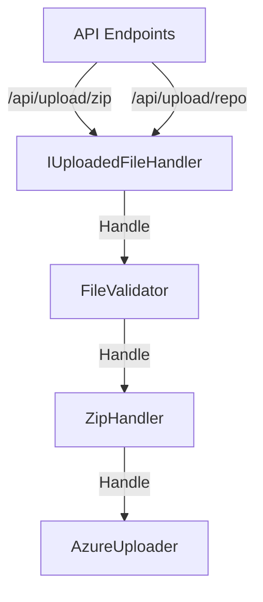

# Getting started

## Prerequisites

Setup launchsettings (default based on launchSettings.example.json should be fine).

Setup appsettings (use appsettings.example.json and fill in the blanks).
AzureBlobStorage isn't being used right now, but it's there for future use.
In the settings section, the path should be absolute.

Format of ConnectionStrings.DefaultConnection:
```bash
  "ConnectionStrings": {
    "DefaultConnection": "Data Source={path to db file};"
```

## Database

The database is setup using Entity Framework Core. To setup the database, run the following commands:

Tool which is needed to run the commands below:
```bash
dotnet tool install --global dotnet-ef
```

Update database with migrations:
```bash
dotnet ef database update
```

